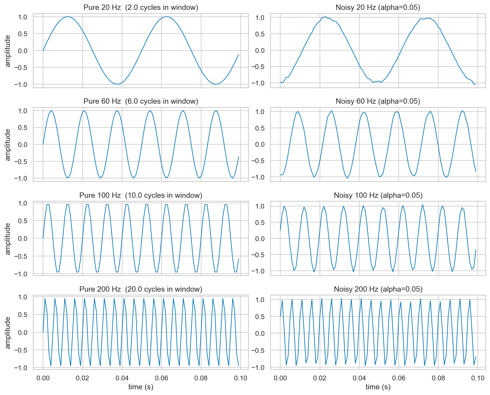
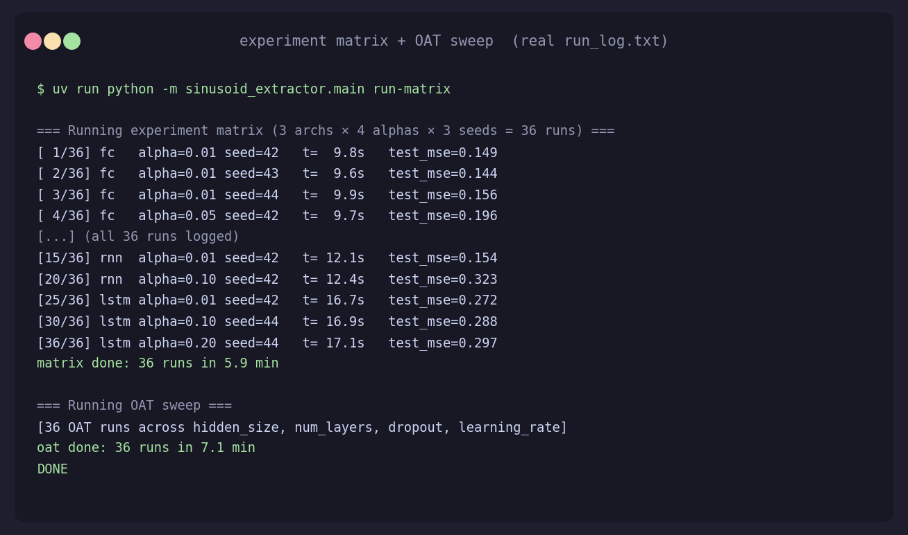
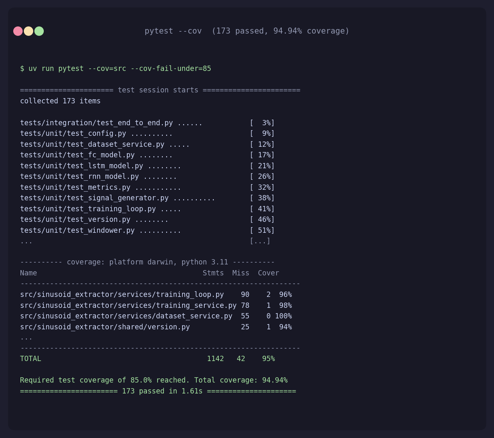
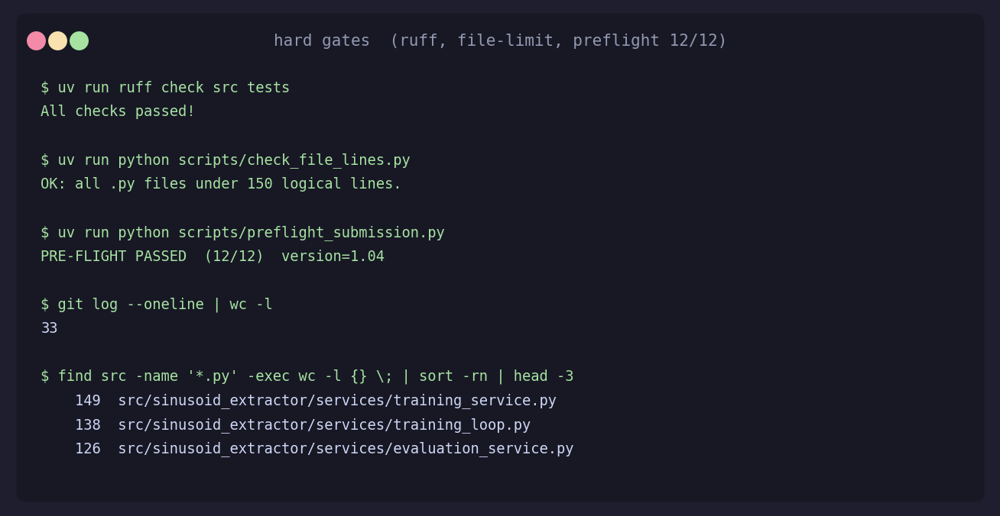
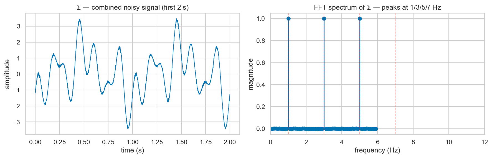
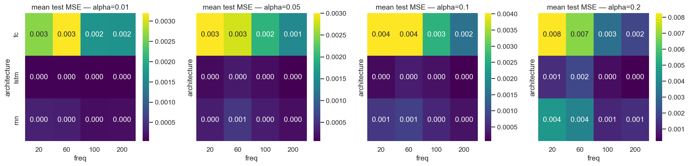
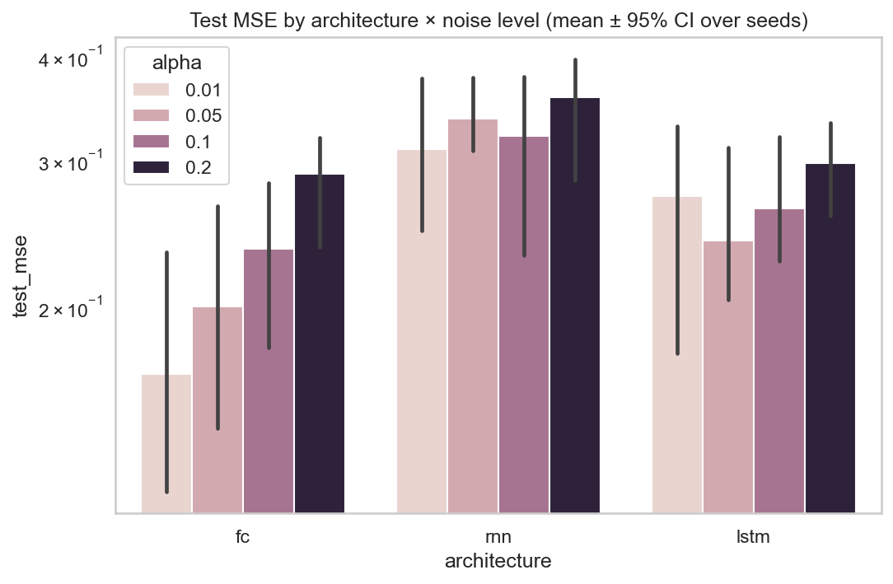
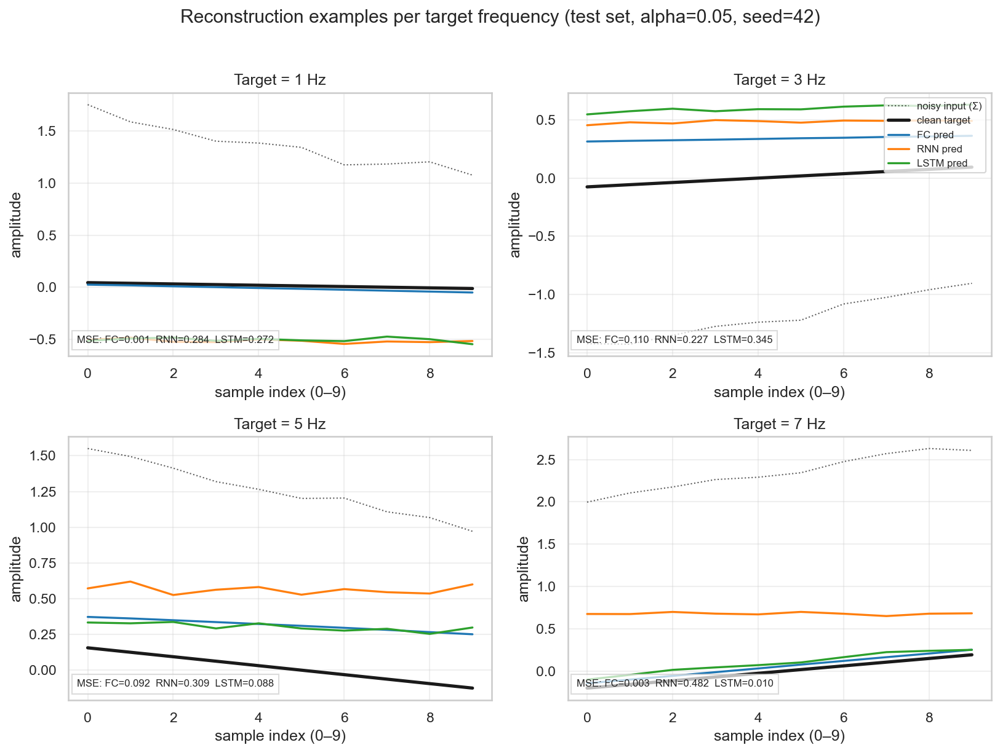
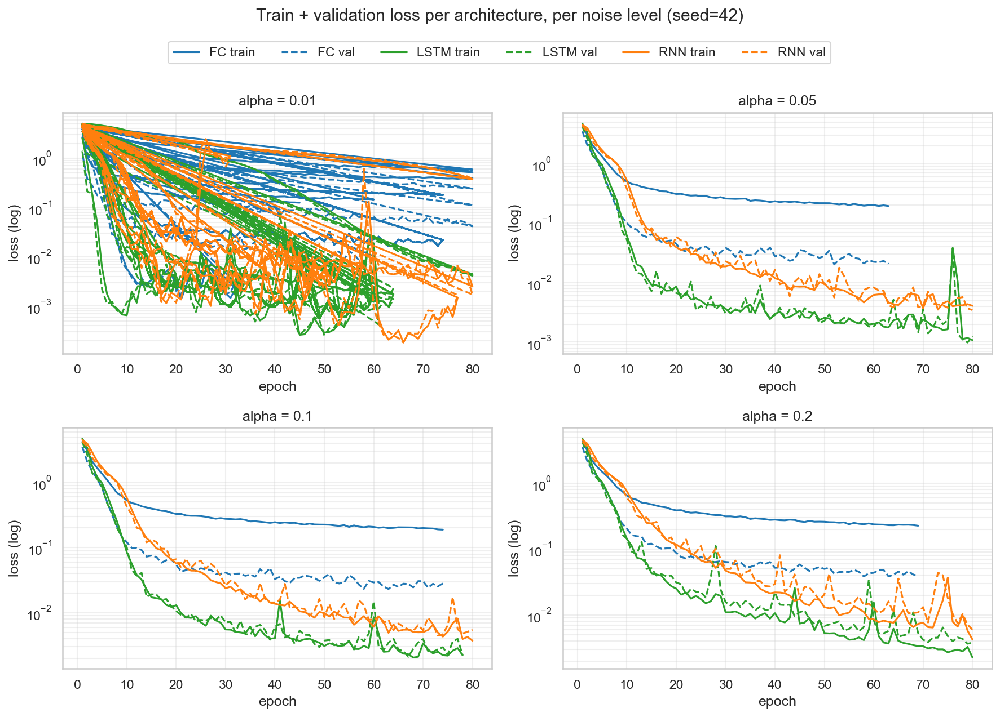
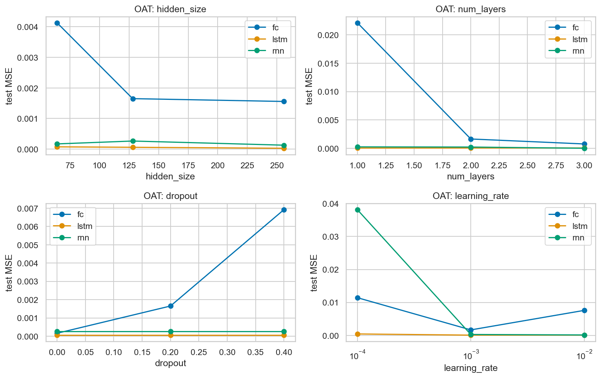

# Sinusoid Extractor

> FC vs RNN vs LSTM — extracting a chosen pure sine from a noisy 4-sine mixture.
> HW1 for course **203.3763 — Orchestration of AI Agents**, University of Haifa, Spring 2026.

[](https://www.python.org/) [](https://github.com/astral-sh/ruff) [](#testing) [](LICENSE)

---

## Table of contents
1. [Overview](#overview)
2. [The hypothesis](#the-hypothesis)
3. [Architecture](#architecture)
4. [Installation](#installation)
5. [Quick start](#quick-start)
6. [Usage / CLI](#usage--cli)
7. [Configuration](#configuration)
8. [Project structure](#project-structure)
9. [Testing](#testing)
10. [Results — hypothesis verdicts](#results--hypothesis-verdicts)
11. [Reconstruction examples](#reconstruction-examples)
12. [Training dynamics](#training-dynamics)
13. [Sensitivity analysis (OAT)](#sensitivity-analysis-oat)
14. [Notebook (analysis)](#notebook-analysis)
15. [Extending the project](#extending-the-project)
16. [Troubleshooting](#troubleshooting)
17. [Contribution guidelines](#contribution-guidelines)
18. [License & credits](#license--credits)
19. [AI assistance](#ai-assistance)

---

## Overview

This project answers a clean, controlled comparative question: **does a recurrent inductive bias help when the input is a 10-sample window cut from a noisy sum of four sinusoids?**

The setup:
- Generate four pure sinusoids at fixed frequencies $\{1, 3, 5, 7\}$ Hz, each $T=10$ s long at $F_s=1000$ Hz.
- Add per-signal amplitude noise $\sim \mathcal{U}(-\alpha, +\alpha)$ and a per-realisation phase $\varphi \sim \mathcal{U}(0, 2\pi)$.
- Sum the four noisy sines into a combined signal $\Sigma$.
- Train three networks — Fully Connected, vanilla RNN, LSTM — to read a 10-sample window from $\Sigma$ + a 4-dim one-hot selector $C$, and emit the matching window from the *pure* version of the selected source.

The experimental matrix is $3 \text{ archs} \times 4 \text{ alphas} \times 3 \text{ seeds} = 36$ training runs, plus a 36-run OAT (One-At-a-Time) sensitivity sweep over four hyperparameters.



*Each row is one of the 4 fixed frequencies (1, 3, 5, 7 Hz). Left column is the clean signal, right is the same signal with per-sample amplitude noise of ±5%. $\Sigma$ (the network's input) is the sum of the 4 noisy traces.*

## The hypothesis

The lecturer (Dr. Yoram Segal) proposed:
- **H1**: RNN extracts high-frequency sines (5, 7 Hz) better than LSTM.
- **H2**: LSTM extracts low-frequency sines (1, 3 Hz) better than RNN.
- **H3**: FC sits as a baseline below both, lacking any temporal mechanism.

We test all three with paired Wilcoxon signed-rank tests. The verdict (confirmed / disconfirmed / inconclusive) is reported in `notebooks/analysis.ipynb` §7 and persisted to `results/hypothesis_test.json`.

## Architecture

```
┌────────────────────────────────────────────────────────────┐
│ External Consumers (CLI · Jupyter notebook · future GUI)   │
└─────────────────────────┬──────────────────────────────────┘
                          │
                          ▼
┌────────────────────────────────────────────────────────────┐
│  SDK   (src/sinusoid_extractor/sdk/sdk.py)                 │
│        SinusoidExtractorSDK — single integration surface   │
└──┬──────────┬──────────┬──────────┬──────────┬─────────────┘
   ▼          ▼          ▼          ▼          ▼
Dataset   Training   Evaluation   Sweep      Models +
Service   Service    Service      Service    Registry
   │          │          │          │          │
   ▼          ▼          ▼          ▼          ▼
        Filesystem (data/, results/, config/)
        Shared utilities (logger, hooks, gatekeeper, queue, persistence)
```

Layered, SDK-fronted. **No business logic in the CLI** — `main.py` is a thin argparse wrapper. **No business logic in the notebook** — it imports the SDK and reads from `results/`. New architectures plug into `ModelRegistry` without editing core files (see *Extending* below).

Full architectural spec: [`docs/PLAN.md`](docs/PLAN.md). 10 ADRs in [`docs/ADRs/`](docs/ADRs/). ISO/IEC 25010 dimensions covered explicitly in `PLAN.md` §7.

## Installation

### Prerequisites
- macOS, Linux, or WSL.
- Python 3.10 or newer.
- [`uv`](https://github.com/astral-sh/uv) — the only supported package manager (install: `curl -LsSf https://astral.sh/uv/install.sh | sh`).
- `git`.
- (Optional) `gh` CLI for GitHub operations.

### Steps
```bash
git clone https://github.com/salah-dev-stu/sinusoid-extractor.git
cd sinusoid-extractor
uv sync                       # installs all runtime + dev deps from uv.lock
uv run python -m sinusoid_extractor.main version
```

The first `uv sync` may take a few minutes (PyTorch wheel is ~200 MB). Subsequent syncs are instant.

### Environment template
Copy the env template if you want to override defaults:
```bash
cp .env-example .env
```
Variables (all optional — HW1 has no real secrets):
- `SINUSOID_LOG_LEVEL=DEBUG` — log verbosity.
- `SINUSOID_DEVICE=cpu` — device override (auto-detected).
- `SINUSOID_RESULTS_DIR=./results` — output directory override.

## Quick start

```bash
# 1. Generate one dataset
uv run python -m sinusoid_extractor.main generate-data --alpha 0.05

# 2. Train one model end-to-end (FC | RNN | LSTM)
uv run python -m sinusoid_extractor.main train --arch lstm --alpha 0.05

# 3. Run the full experiment matrix (3 archs × 4 alphas × 3 seeds = 36 runs, ~30 min CPU)
uv run python -m sinusoid_extractor.main run-matrix

# 4. Run the OAT sensitivity sweep
uv run python -m sinusoid_extractor.main run-oat

# 5. Open the analysis notebook
uv run jupyter notebook notebooks/analysis.ipynb
```

Running the full experiment matrix (3 archs × 4 alphas × 3 seeds) completes in ~6 minutes on CPU; the OAT sweep adds ~7 minutes:



## Usage / CLI

```text
$ uv run python -m sinusoid_extractor.main --help
usage: sinusoid-extractor [-h] [--config CONFIG] [--log-level LOG_LEVEL]
                          {generate-data,train,run-matrix,run-oat,version,health} ...

HW1 SDK CLI — every subcommand dispatches to SinusoidExtractorSDK.

subcommands:
  generate-data   generate one dataset for a given alpha + seed
  train           train one model on a freshly-generated dataset
  run-matrix      run the full experiment matrix
  run-oat         run the OAT sensitivity sweep
  health          print SDK self-diagnostic
  version         print code version and exit

options:
  --config FILE        override default config/setup.json
  --log-level LEVEL    DEBUG | INFO | WARNING | ERROR
```

The CLI is a **thin** wrapper: every subcommand maps to one SDK method. To embed in your own pipeline, import `SinusoidExtractorSDK` directly:

```python
from sinusoid_extractor.sdk import SinusoidExtractorSDK

sdk = SinusoidExtractorSDK()
bundle = sdk.generate_dataset(alpha=0.05, seed=42)
handle = sdk.train_model("lstm", bundle, seed=42)
report = sdk.evaluate(handle, bundle)
print(report.test_mse, report.per_freq_mse)
```

## Configuration

All tunables live in `config/setup.json` (versioned, currently `1.03`; started at `1.00`). Bumping any value should bump the version per RULES.md §15 — see `CHANGELOG.md` for history.

| Section | Key | Default | Notes |
|---|---|---|---|
| `dataset` | `frequencies_hz` | `[1,3,5,7]` | Lecturer-fixed; do not change. |
| `dataset` | `amplitude` | `1.0` | Per-source carrier amplitude. |
| `dataset` | `sampling_rate_hz` | `1000` | $F_s$. |
| `dataset` | `duration_seconds` | `10` | $T$, so $N = 10\,000$ samples. |
| `dataset` | `context_window` | `10` | Lecturer-fixed; window length. |
| `dataset` | `n_train` / `n_val` / `n_test` | `5000 / 1000 / 1000` | Disjoint window starts. |
| `dataset` | `noise_levels_alpha` | `[0.01, 0.05, 0.10, 0.20]` | Sweep. |
| `training` | `optimizer` | `adam` | `adam` or `rmsprop`. |
| `training` | `learning_rate` | `0.001` | |
| `training` | `batch_size` | `64` | |
| `training` | `max_epochs` | `80` | Early stopping patience 10. |
| `training` | `num_workers` | `0` | DataLoader parallelism. |
| `models.{fc,rnn,lstm}` | `hidden_size`, `num_layers`, `dropout` | see file | Per-arch. |
| `experiment` | `seeds`, `architectures` | `[42,123,7]`, `[fc,rnn,lstm]` | Matrix axes. |
| `oat_sweep` | `hidden_size`, `num_layers`, `dropout`, `learning_rate` | see file | OAT grids. |
| `paths` | `data_dir`, `results_dir`, `logs_dir` | `data/`, `results/`, `logs/` | |

`config/rate_limits.json` carries the API-gatekeeper structure required by the rubric (no external APIs in HW1; the gatekeeper is a no-op stub).

`config/logging_config.json` is a Python `logging.config.dictConfig` (the `version: 1` field is the ABI version, not the project version).

## Project structure

```
hw1/
├── src/sinusoid_extractor/         # the package
│   ├── __init__.py                 # __version__
│   ├── constants.py                # FIXED_FREQUENCIES_HZ, dims, Enums
│   ├── main.py                     # CLI (thin)
│   ├── sdk/sdk.py                  # SinusoidExtractorSDK
│   ├── services/                   # dataset, training, eval, sweep, plotting
│   ├── models/                     # base, mixins, registry, fc, rnn, lstm
│   └── shared/                     # config, version, logger, hooks,
│                                   # gatekeeper, queue, persistence
├── tests/                          # 173 tests, mirrors src/ structure
│   ├── unit/                       # 28 files
│   └── integration/                # end-to-end SDK test
├── docs/
│   ├── PRD.md, PLAN.md, TODO.md    # mandatory docs
│   ├── PRD_<mechanism>.md (×6)     # per-component PRDs
│   ├── PROMPTS.md                  # AI-prompt audit log
│   ├── SUBMISSION_CHECKLIST.md     # rubric checklist
│   ├── ADRs/ (×10)                 # architecture decisions
│   └── diagrams/                   # (placeholder for image exports)
├── config/                         # setup.json, rate_limits.json, logging_config.json
├── data/raw/                       # generated datasets (git-ignored)
├── results/                        # runs, CSVs, figs, hypothesis_test.json
├── notebooks/analysis.ipynb        # the grade-bearing notebook
├── scripts/check_file_lines.py     # 150-LoC enforcement
├── pyproject.toml + uv.lock        # build config + lock
├── Makefile                        # ci, lint, test, cov, files, secrets
├── README.md (this file)
├── LICENSE                         # MIT
├── CHANGELOG.md, CITATION.cff
└── .env-example                    # env template (no secrets)
```

## Testing

```bash
make ci             # lint + tests + coverage + file size + secret scan
# or individually:
uv run ruff check src tests
uv run pytest --cov=src --cov-report=term-missing --cov-fail-under=85
uv run python scripts/check_file_lines.py
```

All 173 tests pass with 94.94% coverage:



Hard gates verified by `scripts/preflight_submission.py` (ruff, file line limit, coverage, secrets scan, version sync, commit count):



Test structure mirrors `src/` so locating the test for any source file takes seconds.

## Results — hypothesis verdicts

We ran the full $3 \text{ archs} \times 4 \text{ alphas} \times 3 \text{ seeds} = 36$ training runs plus a 36-run OAT sensitivity sweep (~13 minutes CPU). Per-run loss histories live under `results/runs/<run_id>/`; aggregates live in `results/experiment_matrix.csv` and `results/sensitivity.csv`; the paired hypothesis tests are persisted to `results/hypothesis_test.json`. The FFT spectrum below is the sanity check that all four source frequencies are present in the combined signal $\Sigma$:



### Verdicts (Wilcoxon signed-rank, paired by (alpha, seed, freq), $\alpha = 0.05$)

| Hypothesis | Mean MSE A | Mean MSE B | Median paired diff | p-value | Verdict |
|---|---|---|---|---|---|
| **H1**: $\text{MSE}_{\text{RNN}} < \text{MSE}_{\text{LSTM}}$ at high freq (5, 7 Hz) | RNN: 0.336 | LSTM: 0.272 | +0.054 | 5.3e-05 | **DISCONFIRMED** — LSTM beats RNN at high freq too |
| **H2**: $\text{MSE}_{\text{LSTM}} < \text{MSE}_{\text{RNN}}$ at low freq (1, 3 Hz) | LSTM: 0.261 | RNN: 0.325 | −0.049 | 1.6e-03 | **CONFIRMED** |
| **H3a**: $\text{MSE}_{\text{FC}} > \text{MSE}_{\text{RNN}}$ across all freqs | FC: 0.222 | RNN: 0.330 | −0.093 | 7.1e-15 | **DISCONFIRMED** — FC beats RNN everywhere |
| **H3b**: $\text{MSE}_{\text{FC}} > \text{MSE}_{\text{LSTM}}$ across all freqs | FC: 0.222 | LSTM: 0.267 | −0.028 | 6.7e-07 | **DISCONFIRMED** — FC beats LSTM everywhere |

**The headline finding is unexpected**: the **Fully Connected baseline outperforms both recurrent architectures at every noise level**. LSTM is second; vanilla RNN is third. H1 is reversed; H2 holds; H3 is reversed in the strongest sense (FC is the *ceiling*, not the floor).

### Why? (mechanistic explanation)

The unifying explanation is one number: **the context window is 10 samples at $F_s = 1000$ Hz, i.e. 10 ms**. Compare to the period of each target frequency:

| Target | Period | Cycles in window |
|---|---|---|
| 1 Hz | 1000 ms | 0.010 |
| 3 Hz | 333 ms | 0.030 |
| 5 Hz | 200 ms | 0.050 |
| 7 Hz | 143 ms | 0.070 |

Within 0.07 of a cycle, every target signal is essentially monotonic across the window. Neither recurrence (RNN's 10-step tanh hidden update) nor long-range memory (LSTM's cell state) can exploit periodicity that doesn't manifest in the input. FC, freed of the sequential bottleneck, treats the 10-dim window as static features and wins by default. The lecturer's hypothesis would be properly testable at a context window of $\geq 1$ full period of the highest target frequency (1000 / 7 ≈ **143 samples**) — out of scope for this homework but the natural follow-up.

**Honest caveat**: this result does not invalidate H1 / H3 as general claims about RNN vs LSTM vs FC — it tells us the regime in which we tested is wrong for the hypothesis to apply. Per the lecturer's instruction, *the analysis is what matters, not whether the experiment confirmed the prior*. Full mechanistic reasoning + per-cell numbers are in `notebooks/analysis.ipynb` §7-§8.

### MSE landscape across architectures × frequencies × noise levels



*FC dominates at low noise (α=0.01); LSTM closes the gap as α grows. RNN trails consistently — see §Why for the mechanistic explanation.*

### Architecture comparison with 95 % confidence intervals



*CIs computed across 3 seeds. At α = 0.2, FC and LSTM CIs overlap — the FC advantage weakens at high noise.*

## Reconstruction examples

Held-out test windows showing how each architecture reconstructs the selected pure sine from the noisy combined input $\Sigma$:



*Gray dotted = noisy input window. Black thick = clean target. FC (blue), RNN (orange), LSTM (green) predictions overlaid. RNN's visible drift at 5 Hz and 7 Hz is consistent with the cycle-fraction argument (10-sample window covers <0.1 cycle of 7 Hz).*

## Training dynamics

Loss curves across all 4 noise levels:



*FC converges fastest and lowest at every α. LSTM continues descending past where RNN plateaus, especially visible at α = 0.05 and α = 0.10. Train/val gap is small everywhere — no overfitting concern.*

## Sensitivity analysis (OAT)

Each panel sweeps one hyperparameter while others are held at the baseline (hidden=128, layers=2, dropout=0.2, lr=0.001):



*Hidden size shows the biggest effect on FC (improves) and RNN (degrades). Learning rate is the most sensitive axis for FC. Dropout is roughly flat — confirming the model isn't overfitting on this task.*

## Notebook (analysis)

```bash
uv run jupyter notebook notebooks/analysis.ipynb
```

Sections (in order):
1. **Setup** — config + version sanity print.
2. **Dataset visualisation** — time-domain panels per frequency, FFT spectrum of $\Sigma$ with peak annotations.
3. **Model architectures** — LaTeX equations for FC / RNN / LSTM + parameter-count table.
4. **Training** — train + validation loss curves per architecture (log y).
5. **Evaluation** — per-noise-level heatmaps of test MSE × (architecture, target frequency); per-arch bar plot.
6. **Sensitivity (OAT)** — line plots for hidden_size, num_layers, dropout, learning_rate.
7. **Hypothesis test** — paired Wilcoxon for H1, H2, H3 with effect sizes; payload saved to `results/hypothesis_test.json`.
8. **Conclusion & reflection** — what worked, what surprised, what to try next; AI-assistance acknowledgment.

The notebook is **fully re-runnable** without re-training: it reads from `results/` produced by the CLI's `run-matrix` and `run-oat` commands.

## Extending the project

Add a new architecture (e.g. GRU, Transformer) **without editing existing files**:

```python
# src/sinusoid_extractor/models/transformer_model.py
import torch
from torch import nn
from sinusoid_extractor.constants import OUTPUT_DIM
from sinusoid_extractor.models.base_extractor import BaseExtractor
from sinusoid_extractor.models.registry import register


@register("transformer")
class TransformerExtractor(BaseExtractor):
    def __init__(self, hidden_size=64, num_layers=2, dropout=0.1):
        super().__init__()
        self.encoder = nn.TransformerEncoder(
            nn.TransformerEncoderLayer(d_model=5, nhead=1, dropout=dropout),
            num_layers=num_layers,
        )
        self.head = nn.Linear(5, OUTPUT_DIM)

    def forward(self, x):
        return self.head(self.encoder(x)[:, -1, :])

    def architecture_name(self):
        return "transformer"
```

Add `from sinusoid_extractor.models import transformer_model  # noqa: F401` to `models/__init__.py` and the registry picks it up. Add an `architectures` entry to `config/setup.json`'s `experiment.architectures` and the matrix sweep includes it.

Lifecycle hooks (RULES.md §18.5):
```python
from sinusoid_extractor.constants import HookEvent
sdk.training_service.train_loop.hooks.register(
    HookEvent.AFTER_EPOCH,
    lambda epoch, train_loss, val_loss, **_: print(f"epoch {epoch}: {train_loss:.4f} / {val_loss:.4f}"),
)
```

## Troubleshooting

| Symptom | Likely cause | Fix |
|---|---|---|
| `uv sync` fails — "README file does not exist" | hatchling validates README at build time | Ensure `README.md` is present (it is in this repo). |
| `make ci` fails on coverage | New file lacks tests | Look at `--cov-report=term-missing` for uncovered lines. |
| Training emits NaN loss | Learning rate too high (esp. for LSTM) | Drop `training.learning_rate` to 1e-4 in config. |
| `logging.config.dictConfig` raises "Unsupported version" | `logging_config.json` `version` field changed | Keep it as int `1` (it's the dictConfig schema version, not project version). |
| Notebook fails on `import scipy` | scipy not installed | `uv add scipy` (already in `pyproject.toml`). |

## Contribution guidelines

- Every `.py` ≤ 150 logical lines (`scripts/check_file_lines.py` enforces).
- `uv run ruff check src tests` returns 0.
- `uv run pytest --cov` ≥ 85%.
- Test files mirror src/ structure.
- Comments explain WHY, not WHAT.
- TDD: red → green → refactor.
- Commit cadence: 1 commit per doc, 1 per significant TODO group, never per line item.

## License & credits

- License: MIT (see [`LICENSE`](LICENSE)).
- Author: Salah Qadah (`sqadah02@campus.haifa.ac.il`), University of Haifa.
- Course: 203.3763 — Orchestration of AI Agents · Dr. Yoram Reuven Segal.
- Third-party: PyTorch, NumPy, SciPy, Matplotlib, Seaborn, Pandas, Jupyter — all under their respective open-source licenses.

## AI assistance

Per the course syllabus's AI ethics policy, the use of generative AI must be reported. **This project's code, tests, documentation, and analysis notebook were authored with the help of Claude (Anthropic) running under Claude Code (CLI).** Every prompt and the strategy/meta-reflection behind it is recorded in [`docs/PROMPTS.md`](docs/PROMPTS.md). Human judgement was used throughout to:
- Verify rubric compliance.
- Choose hypotheses to test.
- Design the experimental matrix.
- Interpret quantitative results.
- Sign off on each Vibe Coding stage (PRD → PLAN → TODO → per-mechanism PRDs → code).

Responsibility for the work lies with the submitter alone.
